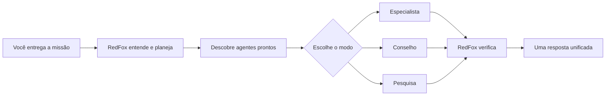

<div align="center">


# RedFox AI Orchestrator 🦊

### Uma IA local para encontrar, organizar e coordenar suas outras IAs.

[](https://github.com/wesleybasso/redfox-ai-orchestrator/releases/latest)
[](https://github.com/wesleybasso/redfox-ai-orchestrator/actions)
[](#requisitos)
[](LICENSE)

[Instalar](#-instalação) · [Como funciona](#-como-a-redfox-trabalha) · [Modos](#-modos-inteligentes) · [Downloads](https://github.com/wesleybasso/redfox-ai-orchestrator/releases/latest) · [Pague um café](https://www.buymeacoffee.com/wesleybasso)

</div>

---

## O que é a RedFox?

A **RedFox** é uma mini IA coordenadora que roda no seu computador. Em vez de você abrir
Claude, Codex, Gemini e outros agentes separadamente, basta conversar com a RedFox. Ela
entende a missão, escolhe a equipe adequada, organiza as rodadas e entrega uma conclusão
única.

Ela usa o **Ollama como cérebro local**, descobre automaticamente ferramentas compatíveis
instaladas no Windows e integra os agentes através do MCO. Você continua usando suas próprias
assinaturas e contas; nenhuma credencial é incluída ou enviada para este repositório.

> **Objetivo:** transformar várias IAs isoladas em um conselho coordenado, sem obrigar você a
> administrar cada agente manualmente.

## ✨ Principais recursos

| Recurso | O que entrega |
| --- | --- |
| 🧠 **Cérebro local** | Ollama e Gemma analisam a missão e ajudam a escolher a estratégia. |
| 🔎 **Descoberta automática** | Identifica agentes instalados, autenticados e disponíveis. |
| 🦊 **Uma única intermediadora** | Você chama apenas `RedFox`; ela conversa com as outras IAs. |
| 🏛️ **Conselho de IAs** | Reúne opiniões, escolhe liderança, revisa e sintetiza o resultado. |
| 🎯 **Especialista certo** | Evita chamar todos os modelos quando um especialista é suficiente. |
| 💰 **Controle de custo** | Usa a rota mais econômica compatível com a complexidade da tarefa. |
| 🔐 **Local e seguro** | Credenciais ficam no perfil do usuário e agentes externos começam em somente leitura. |
| ♻️ **Instalação idempotente** | Pode ser executada novamente para atualizar sem duplicar configurações. |

## 🧩 Duas edições

| | **Somente Skill** | **Programa Completo** |
| --- | --- | --- |
| Ideal para | Quem já usa Trio/MCO | Quem quer preparar tudo do zero |
| RedFox no prompt | ✅ | ✅ |
| Coordenação do conselho | Usa a integração existente | Serviço local persistente |
| Ollama e modelo local | Não instala | Instala e configura |
| Claude, Codex e Gemini CLI | Devem existir | Instala quando necessário |
| Serviço automático | — | ✅ inicia com o Windows |
| Download | [ZIP da Skill](https://github.com/wesleybasso/redfox-ai-orchestrator/releases/latest) | [ZIP Completo](https://github.com/wesleybasso/redfox-ai-orchestrator/releases/latest) |

## 🚀 Instalação

### Programa completo pelo PowerShell

Abra o PowerShell e execute:

```powershell
irm https://raw.githubusercontent.com/wesleybasso/redfox-ai-orchestrator/main/install.ps1 | iex
```

### Programa completo pelo CMD

Abra o Prompt de Comando e execute:

```cmd
curl.exe -fsSL https://raw.githubusercontent.com/wesleybasso/redfox-ai-orchestrator/main/install.cmd -o "%TEMP%\install-redfox.cmd" && call "%TEMP%\install-redfox.cmd"
```

### Somente a Skill

Para quem já possui `using-ai-trio` e MCO configurados:

```powershell
npx skills add wesleybasso/redfox-ai-orchestrator --skill redfox -g -y
```

Alternativa direta pelo PowerShell:

```powershell
irm https://raw.githubusercontent.com/wesleybasso/redfox-ai-orchestrator/main/install-skill.ps1 | iex
```

### Download com dois cliques

1. Abra a página de [Releases](https://github.com/wesleybasso/redfox-ai-orchestrator/releases/latest).
2. Baixe `RedFox-Programa-Completo.zip` ou `RedFox-Somente-Skill.zip`.
3. Extraia o arquivo.
4. No pacote completo, execute `INSTALAR-REDFOX.cmd`. Na edição Skill, execute `INSTALAR-SOMENTE-SKILL.cmd`.

## 🗣️ Como usar

Depois de instalar, abra uma nova conversa no Codex ou Claude e fale normalmente:

```text
RedFox, revise a arquitetura deste projeto.
RedFox, use o conselho para comparar estas duas soluções.
RedFox, encontre a melhor IA para corrigir este erro.
RedFox, pesquise as opções atuais e confira as fontes.
RedFox, quais IAs você encontrou neste computador?
```

Você não precisa escrever “use a skill trio”. A palavra **RedFox** já ativa a coordenadora.

## 🔄 Como a RedFox trabalha



Para tarefas de código, os agentes externos fornecem análise e revisão em modo somente
leitura. O agente da sessão atual aplica as alterações e executa os testes, reduzindo o risco
de várias IAs editarem os mesmos arquivos simultaneamente.

## 🎛️ Modos inteligentes

| Modo | Quando é escolhido | Equipe típica |
| --- | --- | --- |
| **Especialista** | Implementação, correção, revisão focada ou pergunta comum | O agente mais adequado |
| **Pesquisa** | Informação atual, documentação, web e fontes | Pesquisador + verificador |
| **Conselho** | Arquitetura, decisão importante, risco ou alternativas concorrentes | Todos os agentes prontos |
| **Trio** | Solicitação explícita de três perspectivas | Claude + Codex + Gemini |
| **Quinteto** | Análise máxima solicitada pelo usuário | Trio + Qwen + DeepSeek |

A RedFox evita usar todos os modelos em tarefas rotineiras. Isso reduz demora e consumo de
tokens sem abrir mão do conselho quando ele realmente agrega valor.

## 🤖 Agentes compatíveis

- Anthropic Claude Code
- OpenAI Codex CLI
- Google Gemini CLI
- GitHub Copilot CLI
- Qwen Code
- DeepSeek por uma rota compatível
- Outros agentes reconhecidos pelo MCO

Um agente detectado só entra no conselho quando está instalado, autenticado e aprovado nas
verificações de segurança. Agentes indisponíveis aparecem no diagnóstico, mas não são
chamados silenciosamente.

## 🔐 Privacidade e custos

- O cérebro Ollama roda localmente e não exige assinatura.
- Claude, Codex, Gemini e outros serviços usam as contas do próprio usuário.
- Chaves são solicitadas localmente e não fazem parte do projeto.
- O repositório não inclui modelos gigantes; o instalador baixa o modelo escolhido.
- O uso de cada provedor depende do plano e dos limites da respectiva conta.

## Requisitos

- Windows 10 ou Windows 11 x64
- `winget` disponível pelo App Installer da Microsoft
- Internet durante a instalação
- Conta ou API válida para cada serviço externo que você desejar usar

## 🧪 Qualidade e testes

O projeto possui testes automatizados no Windows para validar o pacote público, o coordenador
local, a separação entre as duas edições e a integração do Trio — sem gastar tokens de IA.

```powershell
pwsh -NoProfile -File ./tests/public-release.Tests.ps1
pwsh -NoProfile -File ./redfox-local/tests/RedFox.Local.Tests.ps1
pwsh -NoProfile -File ./redfox-local/tests/RedFox.Setup.Tests.ps1
pwsh -NoProfile -File ./packages/ai-trio/tests/Test-Package.ps1
```

## ☕ Pague um café

Se a RedFox economizou seu tempo ou ajudou no seu projeto, considere apoiar o desenvolvimento:

<div align="center">

[](https://www.buymeacoffee.com/wesleybasso)

**Escaneie o QR Code ou use o botão abaixo.**

[](https://www.buymeacoffee.com/wesleybasso)

**[buymeacoffee.com/wesleybasso](https://www.buymeacoffee.com/wesleybasso)**

</div>

## 🤝 Contribuições

Relatos de erro, ideias e melhorias são bem-vindos nas
[Issues](https://github.com/wesleybasso/redfox-ai-orchestrator/issues). Nunca publique chaves,
tokens ou credenciais em uma issue.

## Licença

Distribuído sob a [Licença MIT](LICENSE). Criado por **Wesley Basso**.

---

<div align="center">

**RedFox — uma missão, várias inteligências, uma resposta.** 🦊

</div>
